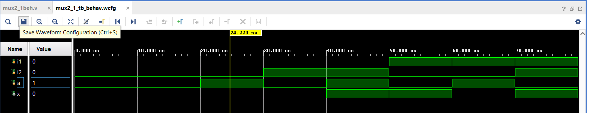
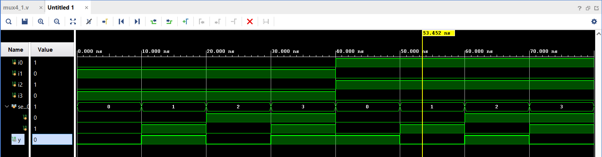
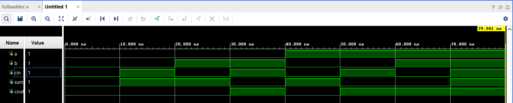

# 100-Days-RTL-challenge
# Day 01-2:1 MUX using behavioral Verilog
🔀 2:1 Multiplexer – Behavioral Verilog
This project implements a 2:1 multiplexer using behavioral modeling in Verilog. A multiplexer (MUX) selects one of two input signals (i1 or i2) based on a control signal (a) and routes it to the output (x).

📁 Files

mux2_1beh.v – Verilog module for the 2:1 MUX

mux2_1_tb.v – Testbench for simulation

Simulation output 

# Day 02-4:1 MUX using structural Verilog.
🔀 4:1 Multiplexer – structural Verilog
Implements a 4:1 multiplexer using structural modeling in Verilog. The output y is selected based on 2-bit input sel.

📁 Files

mux4_1_struct.v: MUX implementation

mux4_1tb.v: Testbench for simulation

Simulation output

# Day 03- 1-bit Full Adder.
🔀 1-bit Full Adder 
This project implements a 1-bit Full Adder using Verilog. A Full Adder takes three inputs (a, b, and cin) and produces two outputs: sum and cout. It is a basic building block used in arithmetic circuits such as adders and ALUs.

📁 Files

fuladd.v – Verilog module for the 1-bit Full Adder

fulladd_tb.v- Testbench for simulation

Simulation output

